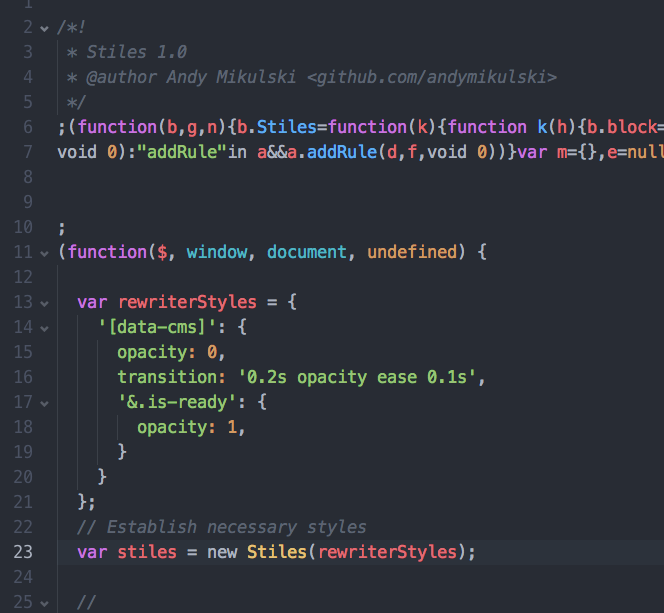

# Stiles
## CSS Injector

Hashmap-based CSS injector. Useful when you need a little bit of CSS on the page for your JS to look sexy, but don't want to (or can't) edit existing CSS files.


## Usage

- Include `stiles.js` or `stiles.min.js` on the page, or if you've got bower, `bower install andymikulski/stiles`.

- Define your CSS object, call `new Stiles(yourStyles)`, and you're in business.

- I like to copy `stiles.min.js` right in the top of the JS file that needs the CSS lovin', like so:




### Usage (Explained)

```
var yourDynamicStyles = {
  '.yourClass': {
    opacity: 0,
    transition: '0.2s opacity ease 0.1s',

    // You can use & to reference the 'current' element
    // (this would be `.yourClass.is-ready`)
    '&.is-ready': {
      opacity: 1,
      color: '#f00'
    },

    // (this would be `.yourClass .child-element`)
    '.child-element': {
      // Stiles pollutes the global namespace with some common CSS keywords,
      // so it's even closer to writing actual CSS!
      // worth it? I like to think so.
      display: block,

      // nesting works just like in SASS or LESS
      '&:hover, &:focus': {
        opacity: 0.5,
        color: '#0f0'
      }
    }
  }
};

// when your styles are ready, just run Stiles on it
var stiles = new Stiles(rewriterStyles);

// wanna make changes to your css?
yourDynamicStyles['.yourClass']['opacity'] = 0.5;

// just refresh with:
stiles.Stilinski(yourDynamicStyles);
```

===


### Credits

Developed by [Andy Mikulski](http://www.andymikulski.com/) when he really probably should have been doing other stuff.
